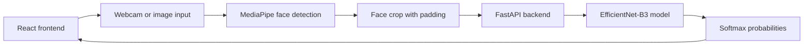

## Made by: Muhammad Ali Zahid - Software & AI Engineer 

### Contact: muhammadalizahid0621@gmail.com

# Facial Expression Recognition Lab Documentation

## Table of Contents

1. [Project Summary](#project-summary)
2. [Purpose and Scope](#purpose-and-scope)
3. [System Overview](#system-overview)
4. [Repository Structure](#repository-structure)
5. [Model Summary](#model-summary)
6. [Training Notebook Summary](#training-notebook-summary)
7. [Dataset Preparation](#dataset-preparation)
8. [Training Pipeline](#training-pipeline)
9. [Deployment Checkpoint](#deployment-checkpoint)
10. [Backend Design](#backend-design)
11. [API Reference](#api-reference)
12. [Frontend Design](#frontend-design)
13. [Webcam Inference Flow](#webcam-inference-flow)
14. [Image Inference Flow](#image-inference-flow)
15. [Real-Time Latency Handling](#real-time-latency-handling)
16. [Setup and Running Guide](#setup-and-running-guide)
17. [Validation Checklist](#validation-checklist)
18. [Troubleshooting](#troubleshooting)
19. [Limitations and Responsible Use](#limitations-and-responsible-use)
20. [Possible Future Improvements](#possible-future-improvements)

## Project Summary

This project is a local web application for testing a custom facial expression recognition model. It combines a FastAPI backend, a PyTorch EfficientNet-B3 model, and a React frontend that can run predictions from a webcam or from uploaded images.

The application is designed for practical model testing. It does not try to be a production service. Its main goal is to make it easy to see how the model behaves on live faces, single images, different lighting conditions, and different expressions.

The system predicts seven emotion classes:

| Index | Class |
|---:|---|
| 0 | angry |
| 1 | disgust |
| 2 | fear |
| 3 | happy |
| 4 | neutral |
| 5 | sad |
| 6 | surprise |

The class order is important. The backend keeps this exact order unless the checkpoint provides a valid class list.

## Purpose and Scope

The project was built around three practical needs:

1. Test the trained model using a normal webcam.
2. Test the same model on uploaded images.
3. Keep real-time inference responsive by avoiding stale frame queues.

The app focuses on:

- Local inference on the user's machine.
- Face-first prediction instead of classifying full webcam scenes.
- A simple interface that shows the detected emotion and confidence.
- A separate image upload workflow for controlled testing.
- Clear backend errors when the model is missing, unloaded, or receives bad input.

The app does not include:

- Authentication.
- Database storage.
- User accounts.
- Cloud deployment.
- Training inside the app.
- Docker as the default setup path.

## System Overview

At a high level, the browser handles camera input, face detection, face cropping, and user interaction. The backend handles model loading and PyTorch inference.



The frontend uses MediaPipe Tasks Vision for face detection. This lowers backend work because the backend receives a cropped face instead of a full camera frame. The backend still stays simple and stateless. It receives one image, preprocesses it, runs inference, and returns the predicted class with probabilities.

## Repository Structure

```text
emotion-webcam-tester/
  backend/
    main.py
    model_loader.py
    requirements.txt
    models/
      fer_deploy_b3_160_stratified_cleanval_v3.pth
  frontend/
    index.html
    package.json
    vite.config.js
    src/
      main.jsx
      App.jsx
      api.js
      styles.css
      components/
        WebcamTester.jsx
        TestImageUpload.jsx
        ModelStatus.jsx
        ProbabilityBars.jsx
      utils/
        emotion score helpers
  README.md
  PROJECT_DOCUMENTATION.md
```

The important files are:

| File | Role |
|---|---|
| `backend/main.py` | FastAPI application, CORS setup, API routes, model path handling |
| `backend/model_loader.py` | EfficientNet-B3 reconstruction, checkpoint loading, preprocessing, inference |
| `backend/requirements.txt` | Python backend dependencies |
| `frontend/src/App.jsx` | Main dashboard layout and model auto-start logic |
| `frontend/src/components/WebcamTester.jsx` | Webcam stream, face detection, frame scheduling, live prediction |
| `frontend/src/components/TestImageUpload.jsx` | Image upload, drag-and-drop, face detection, image prediction |
| `frontend/src/api.js` | Frontend API wrapper for backend calls |
| `frontend/src/styles.css` | Full visual styling for the dark dashboard |

## Model Summary

The deployed model uses a `torchvision` EfficientNet-B3 backbone with a custom classifier head.

The input contract is:

| Item | Value |
|---|---|
| Framework | PyTorch |
| Backbone | `torchvision.models.efficientnet_b3` |
| Input color | RGB |
| Input size | 160x160 |
| Normalization mean | `[0.485, 0.456, 0.406]` |
| Normalization std | `[0.229, 0.224, 0.225]` |
| Output classes | angry, disgust, fear, happy, neutral, sad, surprise |

The classifier head used during training and deployment is:

```python
class SimpleHead(nn.Module):
    def __init__(self, in_features, num_classes, dropout=0.35):
        super().__init__()
        self.classifier = nn.Sequential(
            nn.Dropout(dropout),
            nn.Linear(in_features, 512),
            nn.SiLU(),
            nn.BatchNorm1d(512),
            nn.Dropout(0.25),
            nn.Linear(512, num_classes)
        )

    def forward(self, x):
        return self.classifier(x)
```

This head is recreated exactly in `backend/model_loader.py`. This matters because a mismatch between the training head and the deployment head would make the checkpoint fail to load or behave incorrectly.

## Training Notebook Summary

The training notebook used for this project is named:

```text
notebookb99e5cb042 (1).ipynb
```

The notebook trains an EfficientNet-B3 model at 160x160 resolution using a stratified clean validation setup. The important training configuration is:

| Setting | Value |
|---|---|
| Seed | 42 |
| Training device in notebook | CUDA |
| GPU reported in notebook | Tesla T4 |
| Image size | 160 |
| Batch size | 32 |
| Gradient accumulation | 2 |
| Effective batch size | 64 |
| Epoch limit | 120 |
| Early stopping patience | 15 |
| Validation split | 15 percent |
| Run name | `b3_160_stratified_cleanval_v3` |

The notebook saves a deployment checkpoint named:

```text
fer_deploy_b3_160_stratified_cleanval_v3.pth
```

That file is the one used by the local web app.

## Dataset Preparation

The training workflow combines three public facial expression datasets:

| Dataset | Role in training |
|---|---|
| RAF-DB | Strong facial expression benchmark and webcam-style proxy during testing |
| FERPlus | Large expression dataset with grayscale-style image handling |
| AffectNet | Additional variation across faces, lighting, and expression intensity |

SFEW was intentionally excluded in the notebook because movie frames were found to hurt webcam-focused generalization.

### Raw Dataset Counts

The notebook collected the following raw sample counts:

| Dataset | Samples |
|---|---:|
| RAF-DB | 12,271 |
| AffectNet | 14,549 |
| FERPlus | 56,341 |
| Total | 83,161 |

### Raw Class Distribution

| Class | Samples |
|---|---:|
| angry | 11,205 |
| disgust | 10,946 |
| fear | 10,793 |
| happy | 16,112 |
| neutral | 16,623 |
| sad | 14,073 |
| surprise | 3,409 |

The surprise class had fewer examples than the others, so the notebook added train-only surprise augmentation. Validation remained clean and real.

### Dataset and Class Distribution

| Dataset | angry | disgust | fear | happy | neutral | sad | surprise |
|---|---:|---:|---:|---:|---:|---:|---:|
| AffectNet | 1,500 | 1,229 | 1,512 | 2,340 | 2,758 | 3,091 | 2,119 |
| FERPlus | 9,000 | 9,000 | 9,000 | 9,000 | 11,341 | 9,000 | 0 |
| RAF-DB | 705 | 717 | 281 | 4,772 | 2,524 | 1,982 | 1,290 |

### Train and Validation Split

The notebook used a stratified split by dataset and class. This means the validation set was not made by plain random sampling. The split tried to preserve both dataset source and emotion label balance.

| Split | Samples |
|---|---:|
| Raw train | 70,685 |
| Raw validation | 12,476 |
| Validation ratio | 15 percent |
| Final train after surprise augmentation | 75,788 |
| Final validation | 12,476 |

Train distribution by class:

| Class | Samples |
|---|---:|
| angry | 9,524 |
| disgust | 9,304 |
| fear | 9,174 |
| happy | 13,695 |
| neutral | 14,129 |
| sad | 11,962 |
| surprise | 2,897 before added augmentation |

Validation distribution by class:

| Class | Samples |
|---|---:|
| angry | 1,681 |
| disgust | 1,642 |
| fear | 1,619 |
| happy | 2,417 |
| neutral | 2,494 |
| sad | 2,111 |
| surprise | 512 |

Surprise augmentation increased training surprise samples from 2,897 to 8,000. This extra data was only added to training. It was not added to validation.

## Training Pipeline

### Image Preprocessing

The model was trained and deployed with the same base preprocessing contract:

1. Convert image to RGB-compatible input.
2. Resize to 160x160 for validation and inference.
3. Convert to tensor.
4. Normalize with ImageNet mean and standard deviation.

For FERPlus grayscale images, the notebook converted grayscale input into 3 channels so the EfficientNet-B3 backbone could process it in the same format as RGB images.

### Training Augmentation

The notebook used different transform pipelines depending on the image source.

RGB training images used:

- Resize to 176x176.
- Random crop to 160x160.
- Random horizontal flip.
- Random rotation up to 12 degrees.
- Color jitter for brightness, contrast, saturation, and hue.
- Small random affine translation and scale.
- ImageNet normalization.
- Random erasing.

FERPlus grayscale training images used:

- Grayscale conversion to 3 channels.
- Resize to 176x176.
- Random crop to 160x160.
- Random horizontal flip.
- Random rotation up to 12 degrees.
- Small random affine translation and scale.
- ImageNet normalization.
- Random erasing.

Surprise-class augmentation used stronger variation:

- Resize to 180x180.
- Random crop to 160x160.
- Random horizontal flip.
- Random rotation up to 18 degrees.
- Stronger color jitter.
- Random affine transform with rotation, translation, and scale.
- ImageNet normalization.
- Random erasing.

Validation and test images stayed clean:

- Resize to 160x160.
- Tensor conversion.
- ImageNet normalization.

This clean validation setup is important because validation should measure the model on real data, not augmented copies.

### Sampling and Class Balance

The notebook used `WeightedRandomSampler` for the training loader. Each sample weight was based on the inverse of its class count. This helped reduce the effect of class imbalance without putting class weights inside the loss function.

The loss function was:

```python
nn.CrossEntropyLoss(label_smoothing=0.05)
```

The training loop used:

- 15 percent MixUp.
- 10 percent CutMix.
- 75 percent clean batches.
- Mixed precision when CUDA was available.
- Gradient clipping with max norm 1.0.
- Gradient accumulation over 2 batches.

Because MixUp and CutMix blend labels, training accuracy was treated as approximate. Validation accuracy was treated as the main signal.

### Optimizer and Scheduler

The optimizer was AdamW with layerwise learning rates:

| Component | Learning rate behavior |
|---|---|
| Classifier head | Highest learning rate |
| Deeper EfficientNet blocks | Medium learning rate |
| Earlier EfficientNet blocks | Lower learning rate |

The base learning rate was `2e-4`, with decay `0.8` across feature blocks. Weight decay was `1e-4`.

The scheduler was:

```python
CosineAnnealingWarmRestarts(T_0=20, T_mult=2, eta_min=1e-7)
```

The notebook also supported resume-safe training through latest checkpoints. It saved optimizer, scheduler, scaler, epoch, best accuracy, patience counter, and history.

### Evaluation

After training, the notebook loaded the best checkpoint and evaluated it on:

- RAF-DB test set.
- AffectNet test set.
- FERPlus test set.
- Combined test set.
- Clean stratified validation set.

It also generated:

- RAF-DB confusion matrix.
- Normalized RAF-DB confusion matrix.
- Training loss curve.
- Validation loss curve.
- Training accuracy curve.
- Validation accuracy curve.

RAF-DB was treated as the most useful webcam-style proxy because it is closer to controlled facial expression testing than many noisy web images.

## Deployment Checkpoint

The deployment checkpoint is expected to be placed here:

```text
backend/models/fer_deploy_b3_160_stratified_cleanval_v3.pth
```

The checkpoint format is expected to contain:

```python
{
    "model_state_dict": ...,
    "classes": ["angry", "disgust", "fear", "happy", "neutral", "sad", "surprise"],
    "num_classes": 7,
    "img_size": 160,
    "architecture": "efficientnet_b3",
    "run_name": "b3_160_stratified_cleanval_v3",
    "val_accuracy": ...,
    "raf_accuracy": ...,
    "affectnet_accuracy": ...,
    "ferplus_accuracy": ...,
    "combined_accuracy": ...,
    "best_epoch": ...
}
```

The backend can still load a checkpoint if some metadata is missing. It falls back to:

- The default seven classes.
- Image size 160.
- Architecture name `efficientnet_b3`.

The backend requires `model_state_dict`. If that key is missing, the model cannot be loaded.

## Backend Design

The backend is a FastAPI app running on:

```text
http://localhost:8000
```

Its main responsibilities are:

1. Load the `.pth` model checkpoint.
2. Recreate EfficientNet-B3 and the custom `SimpleHead`.
3. Keep the model in memory.
4. Accept image input from the frontend.
5. Apply the correct preprocessing.
6. Run PyTorch inference.
7. Return class probabilities and inference time.

The backend is intentionally stateless for prediction. It does not remember previous predictions and does not smooth outputs. That keeps inference simple and predictable.

### Model Loading

The backend chooses the device automatically:

```python
"cuda" if torch.cuda.is_available() else "cpu"
```

The model loader first attempts a safer PyTorch load path with `weights_only=True`. If the checkpoint contains older Python or NumPy objects that PyTorch rejects in safe mode, it falls back to a full checkpoint load. This fallback should only be used for trusted local checkpoints.

After loading:

- The architecture is checked.
- The model state dictionary is loaded with `strict=True`.
- The model is moved to the selected device.
- The model is set to `eval()` mode.
- The preprocessing transform is rebuilt using the checkpoint image size.

### Inference Preprocessing

Every image sent to the backend is processed as:

```text
PIL image -> RGB -> resize to 160x160 -> tensor -> ImageNet normalization
```

This is critical. The model was not trained on grayscale deployment input and it was not trained on 224x224 deployment input. Using the wrong color mode, image size, or normalization would reduce prediction quality.

### Prediction Output

The backend uses:

- `torch.no_grad()`
- Forward pass through the model.
- Softmax over logits.
- Percentage conversion.
- One decimal rounding for probabilities.

A typical response looks like:

```json
{
  "top": "happy",
  "confidence": 91.2,
  "probabilities": {
    "angry": 0.3,
    "disgust": 0.1,
    "fear": 0.4,
    "happy": 91.2,
    "neutral": 5.1,
    "sad": 1.2,
    "surprise": 1.7
  },
  "inference_ms": 18.4
}
```

## API Reference

### `GET /health`

Checks whether the backend is alive and whether a model is loaded.

Example response:

```json
{
  "status": "ok",
  "model_loaded": true,
  "device": "cuda",
  "model_path": "backend/models/fer_deploy_b3_160_stratified_cleanval_v3.pth",
  "classes": ["angry", "disgust", "fear", "happy", "neutral", "sad", "surprise"],
  "img_size": 160,
  "metadata": {
    "val_accuracy": 0.0,
    "raf_accuracy": 0.0,
    "best_epoch": 0,
    "num_classes": 7
  }
}
```

### `POST /load-model`

Loads a model checkpoint into memory.

Request:

```json
{
  "model_path": "backend/models/fer_deploy_b3_160_stratified_cleanval_v3.pth"
}
```

The backend supports several path forms. If the path is relative, it checks common project locations, including the backend folder and `backend/models`.

### `POST /predict`

Runs prediction on a multipart image file.

Request type:

```text
multipart/form-data
```

Field:

```text
file
```

This is the main endpoint used by webcam and image upload flows.

### `POST /predict-base64`

Runs prediction on a base64 image.

Request:

```json
{
  "image": "data:image/jpeg;base64,..."
}
```

This endpoint is useful for debugging or alternate frontend clients.

### Common Backend Errors

| Situation | Backend response |
|---|---|
| Model file does not exist | `404 Model file not found` |
| Model is not loaded before prediction | `400 Model not loaded` |
| Uploaded image is empty | `400 Empty image payload` |
| Uploaded image is invalid | `400 Invalid image file` |
| Checkpoint structure is wrong | `400 Failed to load model` |
| Inference crashes | `500 Prediction failed` |

## Frontend Design

The frontend is a React and Vite app running on:

```text
http://localhost:5173
```

The current UI is a dark, academic-style dashboard. It is intentionally simple for the end user:

- Live camera on one side.
- Live emotion result on the other side.
- Image upload section below.
- Image result beside the upload area.
- Emotion reference section.
- Short explanation section at the bottom.

The app automatically loads the model when the page starts. The user does not need to type a model path in the UI.

The frontend does not show backend model metadata in the main interface. This keeps the app focused on testing emotions rather than showing internal checkpoint details.

## Webcam Inference Flow

The webcam flow is handled by `WebcamTester.jsx`.

The flow is:

1. User presses Start.
2. Browser opens the webcam using `navigator.mediaDevices.getUserMedia`.
3. The video stream is shown on the page.
4. MediaPipe FaceDetector runs in video mode.
5. The largest detected face is selected.
6. A padded face crop is made from the video frame.
7. The crop is converted to JPEG.
8. The crop is sent to `POST /predict`.
9. The backend returns prediction probabilities.
10. The UI updates only after the backend response arrives.

The face crop uses about 20 percent padding around the detected face. This helps include useful facial context while still keeping the input focused on the person, not the whole room.

If no face is detected, the app does not send a prediction. This prevents accidental classification of walls, furniture, or other background content.

## Image Inference Flow

The image testing flow is handled by `TestImageUpload.jsx`.

The user can:

- Choose an image from the file picker.
- Drag and drop an image into the upload area.
- Allow full-image fallback if no face is detected.

The normal image flow is:

1. User uploads an image.
2. The image is previewed.
3. MediaPipe FaceDetector runs in image mode.
4. The largest face is selected.
5. The face is cropped with padding.
6. The crop is sent to the backend.
7. The predicted emotion, confidence, and inference time are shown.

If no face is found and full-image fallback is disabled, the app shows an error. If fallback is enabled, the full image is sent to the model. This is useful for debugging, but face crops are preferred because the model expects a face-focused input.

## Real-Time Latency Handling

Real-time webcam inference can easily become delayed if every captured frame is sent to the backend. For example, if frames are captured faster than the backend can answer, the app may build a queue of old frames. The result is high latency, where the UI shows predictions for expressions that happened several seconds ago.

This project avoids that with a latest-frame priority strategy.

The frontend behavior is:

1. Only one prediction request is allowed to be in flight.
2. If a new face frame arrives while a request is running, it replaces the older waiting frame.
3. When the current request finishes, only the newest waiting frame is processed.
4. Old frames are dropped instead of being processed later.

This keeps the prediction output closer to what the camera is seeing now.

The webcam target rate is set to 13 frames per second for scheduling. Actual prediction rate can be lower depending on:

- CPU or GPU speed.
- Browser performance.
- Camera resolution.
- MediaPipe detection speed.
- Backend inference time.
- Network overhead between browser and local backend.

## Setup and Running Guide

### Requirements

Recommended versions:

- Python 3.11
- Node.js 18 or newer
- npm
- A webcam for live testing

Python 3.11 is recommended because PyTorch support can be smoother than Python 3.13 on Windows.

### Model Placement

Place the model checkpoint here:

```text
emotion-webcam-tester/backend/models/fer_deploy_b3_160_stratified_cleanval_v3.pth
```

### Backend Setup on Windows

From the project root:

```powershell
cd backend
py -3.11 -m venv .venv
.\.venv\Scripts\Activate.ps1
python -m pip install --upgrade pip
pip install -r requirements.txt
uvicorn main:app --reload --host 0.0.0.0 --port 8000
```

If PowerShell blocks the activation script, run:

```powershell
Set-ExecutionPolicy -Scope CurrentUser RemoteSigned
```

Then reopen PowerShell and activate the environment again.

### Backend Setup on macOS or Linux

```bash
cd backend
python3.11 -m venv .venv
source .venv/bin/activate
python -m pip install --upgrade pip
pip install -r requirements.txt
uvicorn main:app --reload --host 0.0.0.0 --port 8000
```

### Frontend Setup

Open a second terminal:

```bash
cd frontend
npm install
npm run dev
```

Open:

```text
http://localhost:5173
```

The backend must stay running at:

```text
http://localhost:8000
```

### Build Check

To confirm the frontend compiles:

```bash
cd frontend
npm run build
```

## Validation Checklist

Use this checklist after setup:

- [ ] Backend starts on `http://localhost:8000`.
- [ ] Frontend starts on `http://localhost:5173`.
- [ ] Model file is inside `backend/models`.
- [ ] Page shows that the model is ready.
- [ ] Camera starts when Start is pressed.
- [ ] A face box appears around the detected face.
- [ ] No prediction is made when no face is visible.
- [ ] Live emotion result updates after backend responses.
- [ ] Confidence appears with the displayed emotion.
- [ ] Uploaded image preview appears after image selection.
- [ ] Drag-and-drop image upload works.
- [ ] Image emotion result appears after processing.
- [ ] Full-image fallback works only when enabled.
- [ ] Happy, neutral, sad, angry, disgust, fear, and surprise can be tested with sample images.

## Troubleshooting

### Model file not found

Check that the file exists here:

```text
backend/models/fer_deploy_b3_160_stratified_cleanval_v3.pth
```

Also confirm the backend was started from the `backend` folder or that the relative path still points to the correct model file.

### PyTorch checkpoint load error

Newer PyTorch versions may reject older checkpoints when using safe loading. The backend already tries safe loading first and then falls back to full loading for trusted local checkpoints.

Only use checkpoints that you created yourself or received from a trusted source.

### Camera does not start

Check:

- Browser camera permission.
- Whether another app is already using the camera.
- Whether the page is opened from `localhost`.
- Whether the site is loaded through a secure context if testing on another device.

For this local app, the recommended path is testing on the same PC at `localhost`.

### No prediction appears

Possible causes:

- The model is still loading.
- The backend is not running.
- No face is detected.
- The face is too far from the camera.
- Lighting is too dark.
- The browser failed to load the MediaPipe model.
- The backend returned an error.

Open the browser console and backend terminal if the UI error message is not enough.

### Predictions feel delayed

The app already drops old frames and keeps only the newest waiting frame. If delay is still high:

- Close other heavy apps.
- Use better lighting so face detection is easier.
- Reduce browser tabs.
- Use a machine with a GPU for backend inference.
- Keep frontend and backend on the same machine.

### Prediction quality changes with lighting

Facial expression models are sensitive to:

- Lighting direction.
- Shadows.
- Glasses glare.
- Face angle.
- Distance from camera.
- Crop quality.
- Expression intensity.

Use front-facing lighting and keep the face inside the camera view for more stable testing.

## Limitations and Responsible Use

Facial expression recognition is not the same as understanding a person's real emotional state. The model predicts visual expression labels from an image. It does not know context, intention, culture, personality, or what the person is actually feeling.

This project should be used as a model testing and computer vision demonstration tool. It should not be used for sensitive decisions such as hiring, discipline, mental health judgement, surveillance, or any situation where a wrong prediction could harm someone.

The app processes images locally during normal use. Still, users should avoid testing with private images unless they are comfortable using them in a local development environment.

## Possible Future Improvements

Useful next steps could include:

1. Add backend-side face detection as a backup when MediaPipe fails in the browser.
2. Add a small local test gallery with known sample images.
3. Add optional logging for experiments, disabled by default.
4. Add per-session charts for prediction stability.
5. Add camera resolution controls.
6. Add a benchmark page for average inference time.
7. Add ONNX export for faster CPU inference.
8. Add a small script to verify checkpoint compatibility before running the web app.

## Closing Notes

This project brings the training notebook and local testing interface into one practical workflow. The notebook handles dataset collection, balancing, training, validation, and checkpoint export. The web app then loads that checkpoint and tests it in the conditions that matter most for a facial expression project: webcam input, face crops, single-image checks, lighting changes, and real user expressions.

The strongest engineering idea in the app is the latest-frame priority pipeline. It keeps webcam testing usable by dropping stale frames instead of letting old camera images wait in a queue. That makes the interface feel closer to real time and helps the user judge the model more honestly during live testing.
